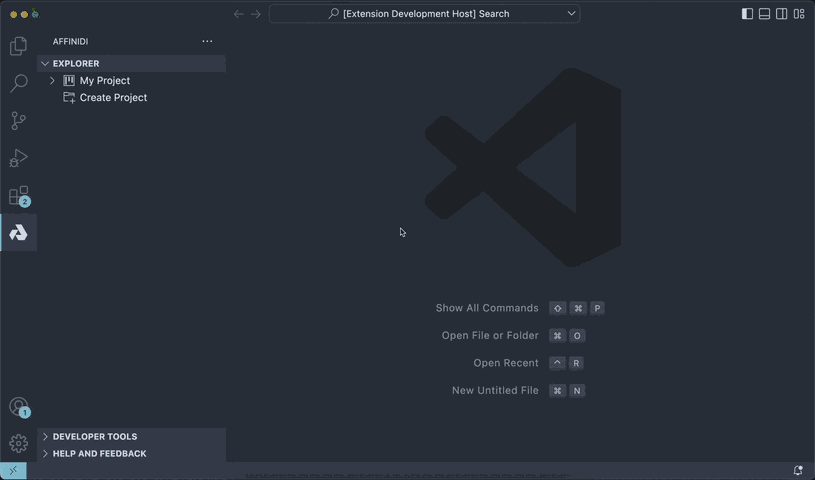

# Affinidi for Visual Studio Code

## What is Affinidi?

The digital world is changing, and customers today want greater control and ownership of their data. As a developer, you can meet these demands and create apps that empower your customers to better manage their privacy, data storage, and portability. In other words, customers who use apps can decide how and where their data will be used.

Affinidi’s vision is to empower communities with control and ownership of their data, thereby creating new business models and greater trust.

In line with this vision, Affinidi has developed an extension that provides access to Affinidi Developer Tools directly within Visual Studio Code. This extension is a one-stop place for all the tools you need to build privacy-preserving applications, without having to leave your IDE.

## Who is this extension for?

Affinidi VS Code Extension makes it easy to meet your customers’ demands for data ownership and privacy.  
It assists you in building an application that can issue, verify and claim verifiable credentials.

To get a hang of the basics, browse through [VCs](https://academy.affinidi.com/what-are-verifiable-credentials-79f1846a7b9), [trust triangle](https://academy.affinidi.com/what-is-the-trust-triangle-9a9caf36b321), [Decentralized Identifiers (DIDs)](https://academy.affinidi.com/demystifying-decentralized-identifiers-dids-2dc6fc3148fd), and [selective disclosure](https://academy.affinidi.com/a-detailed-guide-on-selective-disclosure-87b89cea1602).

## Getting started

In order to use the extension, you first need to create an Affinidi account and a project.  
To do that, click on Affinidi logo in sidebar, then click on “Create an account with Affinidi”, enter your email and the OTP code that you received in your inbox.

Once the account is created, a project named `Default Project` will be created automatically. As part of it, a digital identity will be created for you – your personal DID.

Initially the `Default Project` will be set as your `Active Project`.

Your `Active Project` is the project on which you can perform all the [operations](#features) below. There will always be only 1 active project at a time.

You can also manually create projects by clicking on `Create Project` button and enter a project’s name.
As the default project is the active project, all other projects will be shown under the `Inactive Projects` folder.

You can quickly change the active project any time by clicking on the respective `Activate` icon.

## Features

You can do a lot of things with the Affinidi extension, including:

- Manage your VC Schemas or create a new one without leaving the VS Code app,
- Manage your Issuances or perform a bulk issuance to send VCs to your customers to claim,
- Generate ready-to-use scripts and snippets – for sending a VC offer, signing a credential with Cloud Wallet, etc.,
- Generate a reference app that you can use as an example and build upon,
- …and more!

## Schema Manager

Schema manager is a tool for creating, hosting and managing VC Schemas.  
VC Schema is a composite of JSON-LD context, JSON Schema files and additional metadata (version, description and ownership).

You can create public or unlisted schemas.  
Public schemas are searchable and usable by everyone, while unlisted schemas can be used as a drafting tool to polish your schemas before making them public.

You can fork existing schemas if you want to improve them in any way.  
Forked schemas will be created under a new revision.

## Issuance

It's possible to issue verifiable credentials with our extension without leaving the VS Code app.  
Just select your schema or use an example one as your template and upload a CSV file with a credential subject for each VC.  
We'll send emails to provided targets with a link, which they can use to claim the VC.

## Snippets & scripts

Affinidi extension can help you with your app development by generating ready-to-use scripts and snippets with just a few clicks.  
Script generators can be used to create files from scratch and they will automatically include your API Key Hash, DID and Project ID.

If you don't have a file opened, a ready-to-use boilerplate will be generated for you.

Snippets, on the other hand, allow you to quickly insert small examples of Affinidi API usage.

Available snippets:

| Name                     | Description                                     | Supported Languages       |
| ------------------------ | ----------------------------------------------- | ------------------------- |
| affinidi-create-issuance | Create bulk issuance entity (using fetch)       | Typescript and Javascript |
| affinidi-create-offer    | Create & send bulk issuance offer (using fetch) | Typescript and Javascript |

> For instructions on how to use snippets please refer to [Visual Studio Code snippets documentation](https://code.visualstudio.com/docs/editor/userdefinedsnippets).

## Reference app

If you want an end-to-end example implementation that uses Affinidi APIs, you can generate four types of reference applications directly from the extension.

The Education, Health, and Ticketing apps are flavours of the Certification and Verification use case and include such features as: issuing a credential, claiming & storing it in your wallet, verifying it.

The Career and Gaming apps are flavours of the Portable Reputation usecase and allow the builder to connect to different data sources to construct a portable, user-owned and -managed reputation app that provides access to specific experiences, events or memberships.

Just click the buttons with the app names in the "App Generators" category:

## Telemetry

Affinidi collects usage data to improve our products and services. For information on what data we collect and how we use your data, please refer to our [Privacy Policy](https://build.affinidi.com/dev-tools/privacy-policy.pdf).

## Feedback, Support, and Community

[Click here](https://github.com/affinidi/vscode-extension/issues) to create a ticket and we will get on it right away. If you are facing technical or other issues, you can reach out to us on [Discord](https://discord.com/invite/jx2hGBk5xE).

## FAQ

### A note from Affinidi

Affinidi Developer Tools are currently in the open beta phase and we are refining our product every day. The Affinidi Developer Tools may be incomplete and may contain errors – they may be unstable and may cause a loss of functionality and data. Use of the Affinidi Developer Tools will be at your own risk. As our engineers seek to improve our platform, we would not have the resources to provide any maintenance or tech support at this time. Please bear with us as we continue to improve the platform.

### What can I develop?

You are only limited by your imagination! Affinidi Developer Tools is a toolbox with which you can build software applications for personal or commercial use.

### Is there anything I should not develop?

We only provide the tools - how you use them is largely up to you. We have no control over what you develop with our tools - but please use our tools responsibly!

We hope that you would not develop anything that contravenes any applicable laws or regulations. Your projects should also not infringe on Affinidi’s or any third party’s intellectual property (for instance, misusing other parties’ data, code, logos, etc).

### What responsibilities do I have to my end-users?

Please ensure that you have in place your own terms and conditions, privacy policies, and other safeguards to ensure that the projects you build are secure for your end users.

If you are processing personal data, please protect the privacy and other legal rights of your end-users and store their personal or sensitive information securely.

Some of our components would also require you to incorporate our end-user notices into your terms and conditions.

### Are Affinidi Developer Tools free for use?

Affinidi Developer Tools are free during the open beta phase, so come onboard and experiment with our tools and see what you can build! We may bill for certain components in the future, but we will inform you beforehand.

### Is there any limit or cap to my usage of the Affinidi Developer Tools?

We may from time to time impose limits on your use of the Affinidi Developer Tools, such as limiting the number of API requests that you may make in a given duration. This is to ensure the smooth operation of the Affinidi Developer Tools so that you and all our other users can have a pleasant experience as we continue to scale and improve the Affinidi Developer Tools.

### Do I need to provide you with anything?

From time to time, we may request certain information from you to ensure that you are complying with the [Terms of Use](https://build.affinidi.com/dev-tools/terms-of-use.pdf).

### Can I share my developer’s account with others?

When you create a developer’s account with us, we will issue you your private login credentials. Please do not share this with anyone else, as you would be responsible for activities that happen under your account. If you have friends who are interested, ask them to sign up – let's build together!

## _Disclaimer_

_Please note that this FAQ is provided for informational purposes only and is not to be considered a legal document. For the legal terms and conditions governing your use of the Affinidi Developer Tools, please refer to our [Terms of Use](https://build.affinidi.com/dev-tools/terms-of-use.pdf)._
